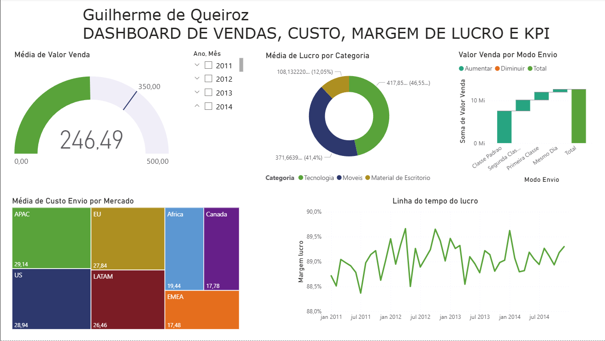

# 📊 Análise de Vendas, Custo, Margem de Lucro e KPI

Este projeto faz parte de um exercício prático de **Análise de Dados** utilizando o **Power BI**.  
O objetivo é explorar um conjunto de dados de vendas, custos de envio e categorias de produtos, aplicando conceitos de **visualização de dados, métricas de desempenho (KPI)** e **análise de rentabilidade**.

---

## 🧠 Objetivos do Estudo

Responder, por meio de gráficos e indicadores no Power BI, às seguintes perguntas de negócio:

1. **Valor de venda por modo de envio:**  
   Qual foi o total de valor de venda considerando cada modo de envio dos pedidos?  
   *(Visualização: gráfico de cascata)*  

2. **Mercados com maior custo médio de envio:**  
   Quais mercados tiveram o maior custo médio de envio dos produtos vendidos?  
   *(Visualização: treemap)*  

3. **Meta de valor médio de venda:**  
   A empresa possui uma meta de manter média de **350** no valor de venda mensal.  
   Foi atingida ou superada essa meta?  
   *(Visualização: KPI – Indicador de Desempenho)*  

4. **Lucro médio por categoria:**  
   Considerando que o **lucro = valor de venda - custo de envio**, qual categoria de produto apresentou o maior **lucro médio**?  
   *(Visualização: gráfico de rosca)*  

5. **Evolução da margem de lucro ao longo do tempo:**  
   Qual foi o comportamento da **margem de lucro (lucro ÷ valor de venda)** ao longo do período analisado?  
   *(Visualização: gráfico de linhas)*  

---

## 🧩 Ferramentas Utilizadas
- **Power BI Desktop**
- **Modelagem de dados**
- **DAX (Data Analysis Expressions)**
- **Visualizações interativas**

---

## 📈 Dashboard

Abaixo está uma captura de tela do dashboard desenvolvido no Power BI, com os principais indicadores e gráficos utilizados para responder às perguntas de negócio:

---

## 📊 Resultados Esperados

Com este exercício, é possível:

- Compreender a relação entre **modos de envio, custos e lucratividade**  
- Identificar **mercados mais caros logisticamente**  
- Avaliar **metas de vendas mensais** com indicadores visuais  
- Analisar a **evolução temporal da margem de lucro** da empresa

---

## 📂 Arquivo do Projeto Power BI

O arquivo principal do projeto está disponível abaixo:

🔗 [lab02.pbix](lab02.pbix)  
Este arquivo contém todas as visualizações, medidas DAX e modelagem utilizadas para responder às perguntas de negócio do Lab 2.

> Para abrir, é necessário o **Power BI Desktop** instalado em sua máquina.

---

## 📫 Contato

**Guilherme de Queiroz**  
Analista de Dados  
[LinkedIn](https://www.linkedin.com/in/guilherme-de-queiroz-5033981b9/)
